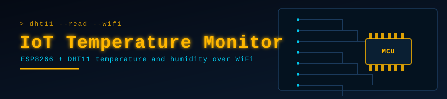

<p align="center">
  
</p>

<p align="center">
  
</p>

<p align="center">
  <a href="https://github.com/muqeetahmaad9/IoT-Temperature-Monitor/stargazers"></a>
  <a href="https://github.com/muqeetahmaad9/IoT-Temperature-Monitor/commits"></a>
  
</p>

---

### 📖 Overview

Reads temperature and humidity from a DHT11 sensor on an ESP8266 and publishes them over WiFi for remote monitoring.

### ✨ Features

- DHT11 temperature and humidity sensing
- ESP8266 WiFi connectivity
- Continuous remote reporting

### 🔌 Hardware

- ESP8266 (NodeMCU)
- DHT11 sensor
- Jumper wires

### 🧰 Built With

<p align="left">
  
</p>

### 🚀 Getting Started

```cpp
// Open `code` in the Arduino IDE
// Install: DHT sensor library, ESP8266WiFi
// Set ssid and password, then upload
```

### 👤 Author

**Muqeet Ahmad** — AI/ML Engineer · IoT & Embedded Systems Builder

<p align="left">
  <a href="https://www.linkedin.com/in/muqeet--ahmad/"></a>
  <a href="https://muqeetahmaad-portfolio.netlify.app/"></a>
  <a href="mailto:muqeetahmad155@gmail.com"></a>
</p>

<p align="center">
  
</p>
